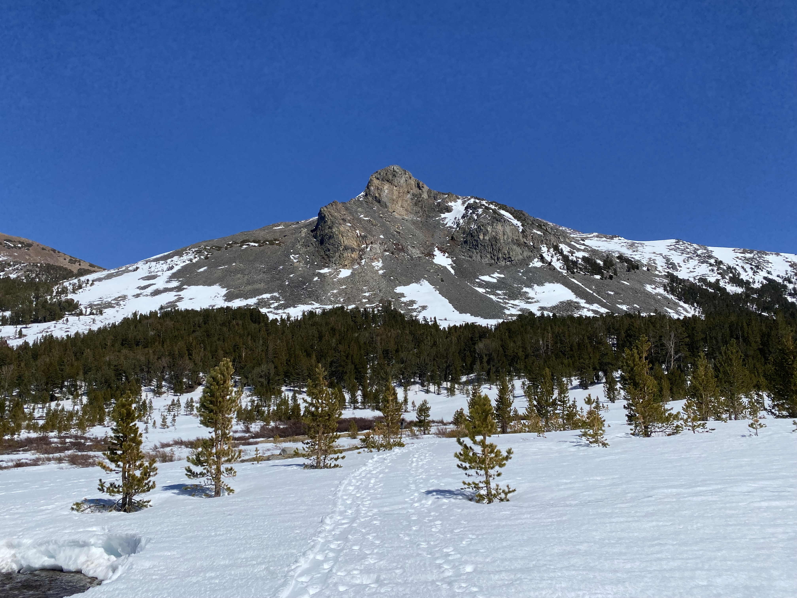
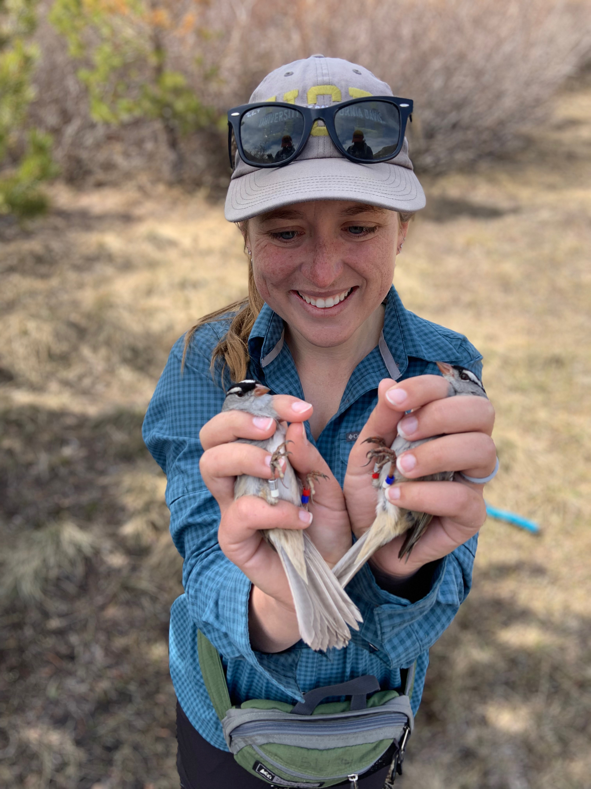

  
  

    Carly Hawkins 
    Behavioral Ecologist | Conservation Biology
  

I am a behavioral ecologist studying how individual variation shapes ecological and evolutionary outcomes, and how behavior can be translated into actionable conservation strategies. My research integrates field ecology, bioacoustics, spatial analysis, and quantitative modeling to understand how animals respond to human-driven environmental change.

I am currently an Adjunct Lecturer at Tufts University and am seeking postdoctoral and faculty positions in behavioral ecology, conservation biology, and wildlife ecology.

---

### Research Focus
- Behavioral diversity and fitness tradeoffs  
- Animal responses to anthropogenic disturbance  
- Translating behavioral data into conservation-relevant thresholds  

### Teaching & Mentorship
- Field-based and research-integrated teaching  
- Strong commitment to undergraduate mentorship  
- Inclusive, transparent pathways into research careers  

[Download CV](cv.md)

